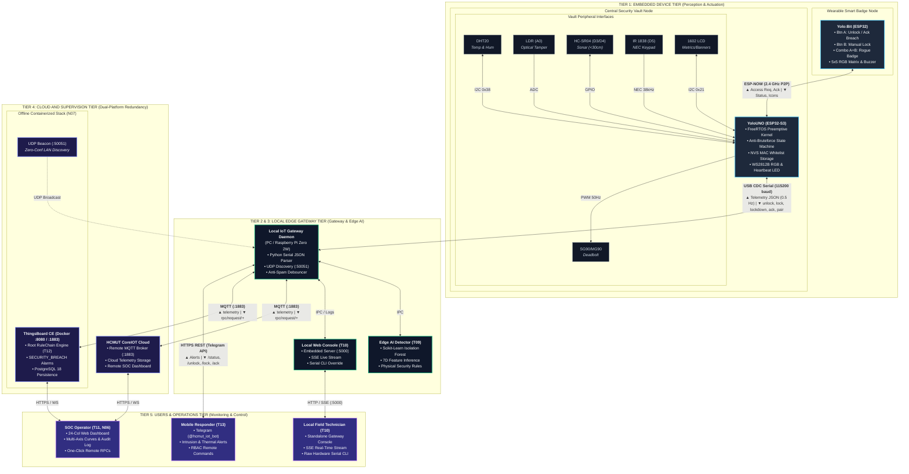

# Smart Safe Guardian — Figure 2.1: System Architecture & Block Diagram

---

```mermaid
flowchart TB
    classDef device fill:#1e293b,stroke:#38bdf8,stroke-width:2px,color:#f8fafc;
    classDef gateway fill:#0f172a,stroke:#10b981,stroke-width:2px,color:#f8fafc;
    classDef cloud fill:#1e1b4b,stroke:#818cf8,stroke-width:2px,color:#f8fafc;
    classDef user fill:#312e81,stroke:#c084fc,stroke-width:2px,color:#f8fafc;
    classDef sensor fill:#111827,stroke:#64748b,stroke-width:1px,color:#cbd5e1;

    subgraph Tier1 ["TIER 1: EMBEDDED DEVICE TIER (Perception & Actuation)"]
        direction LR
        subgraph BadgeNode ["Wearable Smart Badge Node"]
            Badge["<b>Yolo:Bit (ESP32)</b><br/>• Btn A: Unlock / Ack Breach<br/>• Btn B: Manual Lock<br/>• Combo A+B: Rogue Badge<br/>• 5x5 RGB Matrix & Buzzer"]
        end

        subgraph VaultNode ["Central Security Vault Node"]
            direction TB
            Vault["<b>YoloUNO (ESP32-S3)</b><br/>• FreeRTOS Preemptive Kernel<br/>• Anti-Bruteforce State Machine<br/>• NVS MAC Whitelist Storage<br/>• WS2812B RGB & Heartbeat LED"]

            subgraph VaultSensors ["Vault Peripheral Interfaces"]
                direction LR
                DHT20["DHT20<br/><i>Temp & Hum</i>"]
                LDR["LDR (A0)<br/><i>Optical Tamper</i>"]
                Sonar["HC-SR04 (D3/D4)<br/><i>Sonar (&lt;30cm)</i>"]
                IR["IR 1838 (D5)<br/><i>NEC Keypad</i>"]
                LCD["1602 LCD<br/><i>Metrics/Banners</i>"]
                Servo["SG90/MG90<br/><i>Deadbolt</i>"]
            end

            DHT20 <-->|"I2C 0x38"| Vault
            LCD <-->|"I2C 0x21"| Vault
            LDR -->|"ADC"| Vault
            Sonar <-->|"GPIO"| Vault
            IR -->|"NEC 38kHz"| Vault
            Vault -->|"PWM 50Hz"| Servo
        end
    end

    Badge <-->|"<b>ESP-NOW (2.4 GHz P2P)</b><br/>▲ Access Req, Ack | ▼ Status, Icons"| Vault

    subgraph Tier3 ["TIER 2 & 3: LOCAL EDGE GATEWAY TIER (Gateway & Edge AI)"]
        direction LR
        Gateway["<b>Local IoT Gateway Daemon</b><br/>(PC / Raspberry Pi Zero 2W)<br/>• Python Serial JSON Parser<br/>• UDP Discovery (:50051)<br/>• Anti-Spam Debouncer"]
        AI["<b>Edge AI Detector (T09)</b><br/>• Scikit-Learn Isolation Forest<br/>• 7D Feature Inference<br/>• Physical Security Rules"]
        WebConsole["<b>Local Web Console (T10)</b><br/>• Embedded Server (:5000)<br/>• SSE Live Stream<br/>• Serial CLI Override"]

        Gateway <-->|"IPC"| AI
        Gateway <-->|"IPC / Logs"| WebConsole
    end

    Vault <-->|"<b>USB CDC Serial (115200 baud)</b><br/>▲ Telemetry JSON (0.5 Hz) | ▼ unlock, lock, lockdown, ack, pair"| Gateway

    subgraph Tier4 ["TIER 4: CLOUD AND SUPERVISION TIER (Dual-Platform Redundancy)"]
        direction LR
        CoreIOT["<b>HCMUT CoreIOT Cloud</b><br/>• Remote MQTT Broker (:1883)<br/>• Cloud Telemetry Storage<br/>• Remote SOC Dashboard"]
        
        subgraph LocalCloud ["Offline Containerized Stack (N07)"]
            direction TB
            ThingsBoard["<b>ThingsBoard CE (Docker :8080 / :1883)</b><br/>• Root RuleChain Engine (T12)<br/>• SECURITY_BREACH Alarms<br/>• PostgreSQL 18 Persistence"]
            Beacon["UDP Beacon (:50051)<br/><i>Zero-Conf LAN Discovery</i>"]
            Beacon -.->|"UDP Broadcast"| Gateway
        end
    end

    Gateway <-->|"<b>MQTT (:1883)</b><br/>▲ telemetry | ▼ rpc/request/+"| CoreIOT
    Gateway <-->|"<b>MQTT (:1883)</b><br/>▲ telemetry | ▼ rpc/request/+"| ThingsBoard

    subgraph Tier5 ["TIER 5: USERS & OPERATIONS TIER (Monitoring & Control)"]
        direction LR
        UserSOC["<b>SOC Operator (T11, N06)</b><br/>• 24-Col Web Dashboard<br/>• Multi-Axis Curves & Audit Log<br/>• One-Click Remote RPCs"]
        UserField["<b>Local Field Technician (T10)</b><br/>• Standalone Gateway Console<br/>• SSE Real-Time Stream<br/>• Raw Hardware Serial CLI"]
        UserMobile["<b>Mobile Responder (T13)</b><br/>• Telegram (@hcmut_iot_bot)<br/>• Intrusion & Thermal Alerts<br/>• RBAC Remote Commands"]
    end

    CoreIOT <-->|"HTTPS / WS"| UserSOC
    ThingsBoard <-->|"HTTPS / WS"| UserSOC
    WebConsole <-->|"HTTP / SSE (:5000)"| UserField
    Gateway <-->|"<b>HTTPS REST (Telegram API)</b><br/>▲ Alerts | ▼ /status, /unlock, /lock, /ack"| UserMobile

    class Badge,Vault device;
    class DHT20,LDR,Sonar,IR,LCD,Servo sensor;
    class Gateway,AI,WebConsole gateway;
    class CoreIOT,ThingsBoard,Beacon cloud;
    class UserSOC,UserField,UserMobile user;
```
